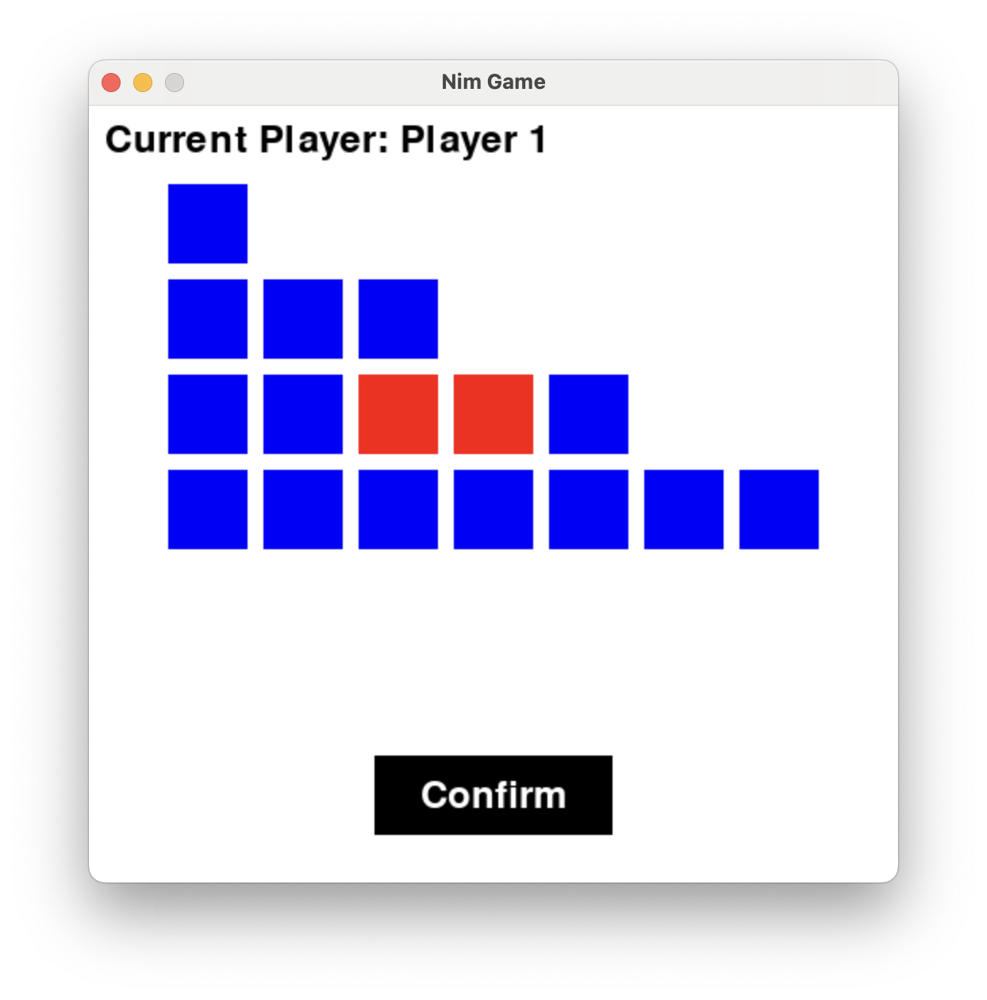

# NimGame

You can play with AI or your friends through double clicking the correct python file.

## Preparation

Download pygame firstly.

``` shell
pip install pygame
```

## Playing

After you run the python file, you can see this window.



The blue means not be selected and the red means be selected.

Click confirm button to ensure your actions and then it is another player's turn.

## Rules

1. You can only choose graphics from one row.
2. You must choose >=1 graphics.
3. The player who pick up the last one will lose.